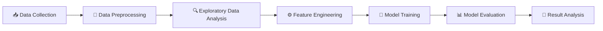

# 🧠 Research Internship ML Project
<p align="center">
  
</p>

<p align="center">
  
</p>

<p align="center">
  
  
  
  
</p>

---

## 🚀 About the Project

<p align="center">
  
</p>

This project was developed as part of a **Research Internship** with the aim of applying Machine Learning techniques to a research-oriented problem.

The project focuses on:

* 🔍 Understanding the research problem and dataset
* 🧹 Processing and preparing the data
* 🤖 Experimenting with Machine Learning models
* 📊 Evaluating model performance
* 🔬 Comparing different approaches
* 💡 Extracting meaningful insights from the experiments

---

# 🎯 Objectives

<div align="center">

|       🔎 Research      |  🤖 Machine Learning |     📊 Analysis    |
| :--------------------: | :------------------: | :----------------: |
| Understand the problem |    Train ML models   |   Analyze results  |
|    Study the dataset   |    Optimize models   | Compare approaches |
|    Explore patterns    | Evaluate performance |  Draw conclusions  |

</div>

### Main Goals

* Understand the given problem and dataset.
* Perform data preprocessing and analysis.
* Apply suitable Machine Learning models.
* Train and evaluate the models.
* Compare the results and identify the better-performing approach.
* Analyze the results and draw conclusions.

---

# 📂 Dataset

<p align="center">
  
</p>

The dataset contains the required information for training and testing the Machine Learning models.

### 🧹 Preprocessing

```text
Raw Dataset
     │
     ▼
┌───────────────┐
│ Data Cleaning │
└───────┬───────┘
        ▼
┌──────────────────┐
│ Missing Values   │
│ Handling         │
└────────┬─────────┘
         ▼
┌──────────────────┐
│ Feature Selection│
└────────┬─────────┘
         ▼
┌──────────────────┐
│ Feature Scaling  │
└────────┬─────────┘
         ▼
┌──────────────────┐
│ Train / Test Split│
└──────────────────┘
```

---

# ⚙️ Methodology

<p align="center">
  
  
  
  
  
  
</p>



---

# 🤖 Machine Learning Models

<p align="center">
  
</p>

The following Machine Learning approaches were experimented with:

| Model      | Purpose               | Status |
| ---------- | --------------------- | ------ |
| 🧠 Model 1 | Baseline / Prediction | ✅      |
| 🧠 Model 2 | Prediction            | ✅      |
| 🌲 Model 3 | Ensemble / Prediction | ✅      |
| ⚡ Model 4  | Advanced Experiment   | ✅      |

> Replace the model names above with the actual models used in the project.

---

# 📊 Results

<p align="center">
  
  
  
  
</p>

The models were evaluated using appropriate performance metrics.

### 📈 Evaluation Metrics

* 🎯 Accuracy
* 🎯 Precision
* 🎯 Recall
* 🎯 F1-Score
* 📉 RMSE
* 📉 MAE
* 📊 Other relevant research metrics

The experimental results were analyzed to understand the strengths and limitations of the different approaches.

---

# 🛠️ Technologies Used

<p align="center">


</p>

### Core Technologies

```text
🐍 Python
🔢 NumPy
🐼 Pandas
📊 Matplotlib
🤖 Scikit-learn
📓 Jupyter Notebook
🔧 Git / GitHub
```

---

# 📁 Project Structure

```text
Research-ML-Project/
│
├── 📂 data/
│   ├── raw/
│   └── processed/
│
├── 📂 notebooks/
│   └── experiments.ipynb
│
├── 📂 src/
│   ├── preprocessing.py
│   ├── training.py
│   └── evaluation.py
│
├── 📂 models/
│   └── trained_models/
│
├── 📂 results/
│   ├── figures/
│   └── metrics/
│
├── 📄 requirements.txt
└── 📄 README.md
```

---

# 🚀 How to Run

### 1️⃣ Clone the Repository

```bash
git clone <repository-link>
cd Research-ML-Project
```

### 2️⃣ Install Dependencies

```bash
pip install -r requirements.txt
```

### 3️⃣ Run the Project

Open the Jupyter notebook:

```bash
jupyter notebook
```

Then run the notebooks/scripts to reproduce the experiments.

---

# 🔬 Research Workflow

<p align="center">
  
</p>

```text
        📚 Research Problem
               │
               ▼
        📊 Dataset Analysis
               │
               ▼
        🧹 Data Processing
               │
               ▼
        ⚙️ Feature Engineering
               │
               ▼
        🤖 ML Experiments
               │
               ▼
        📈 Performance Evaluation
               │
               ▼
        🔬 Research Analysis
               │
               ▼
        💡 Final Insights
```

---

# 💡 Key Takeaways

Through this project, we explored the practical application of Machine Learning in a research environment.

The project provided experience in:

* 📚 Research-oriented problem solving
* 🐍 Python-based ML development
* 📊 Data analysis
* ⚙️ Feature engineering
* 🤖 Machine Learning experimentation
* 📈 Model evaluation
* 🔬 Comparative analysis
* 💡 Drawing conclusions from experimental results

---

# 🔮 Future Work

The project can be extended by:

* 🚀 Experimenting with more advanced models
* 🧠 Exploring Deep Learning approaches
* ⚙️ Improving feature engineering
* 🔧 Performing additional hyperparameter tuning
* 📊 Testing on larger datasets
* 🔬 Conducting more extensive experiments
* 🌐 Exploring real-world deployment

---

# 👨‍💻 Authors

<p align="center">

### 🧠 Research Internship ML Team

</p>

| Name                     |
| ------------------------ |
| **Abhinav Singh**        |
| **Adith N Poojary**      |
| **Adhayan Kumar**        |
| **Aman Kumar Choudhary** |
| **Arpit Sharma**         |

---

<p align="center">


</p>

<p align="center">
  ⭐ If you find this project interesting, consider giving the repository a star! ⭐
</p>

<p align="center">
  
</p>
